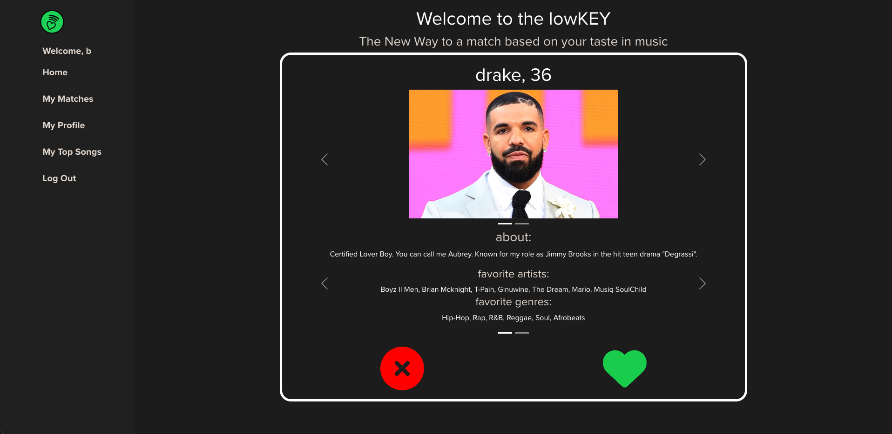
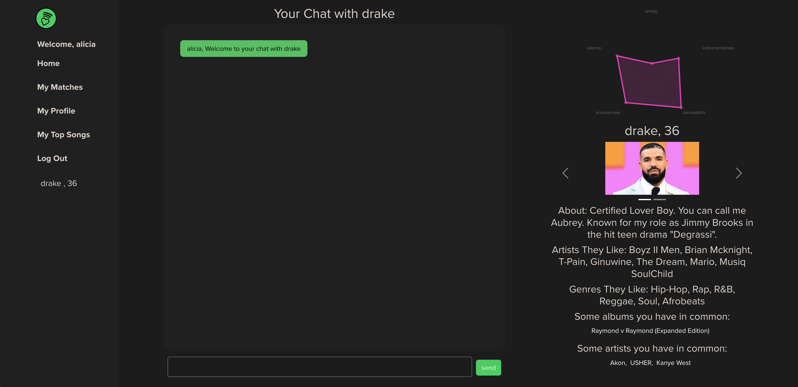

# lowKEY 
lowKEY is a React-based application that leverages the power of the Spotify API to match users based on their musical preferences. Whether you're looking for new friends or potential soulmates who share your taste in music, this app is designed to help you connect with like-minded music enthusiasts. Using Spotify's song features data, users are sorted based on their similarity in metrics such as energy, valence, instrumentalness and more. Once users are matched, they can communicate via private messages implemented using Socket.io, persisting the message log in MongoDB. Furthermore, similarity data is displayed on the match page for a given user's profile, showing what metrics the match scored highly on. 

 

 
 
 
Technologies Used: JavaScript, HTML, CSS, Node.js, Express.js, MongoDB, Mongoose, React, Socket.io, Bootstrap, SpotifyAPI, AWS S3, Chart.js

## Getting Started:
https://lowkey-08ba0f67b0aa.herokuapp.com/

Login or Create an account with lowKEY to begin matching! Note: you must have a valid Spotify account to use this app. 

Once logged in: 
Continue to add information to your profile such as a short biography, genres of music that you enjoy, and artists that you like. You will also have to upload between 1-6 photos of yourself for your profile. Then you will be taken to a page that gives an option to either choose from valid playlists in your library or the top 20 songs that you've listened to in the past 6 months. Then you begin swiping! Once you have a match, navigate to the matches page and select the particular match that you want to start interacting with on the left side under the navigation bar. 

## What's Next: 
#### Known Bugs: 
* If user abandon's profile creation, the account will be created in database with partial information and will throw errors if you try to come back to it. 

#### Additional Features 
* Both selecting your own gender identification and gender preferences.
* Image Cropper 
* An option to use the SpotifyAPI to build a collaborative playlist that is a mashup of the two users of a given match.
* Allow users to select 1-2 songs that can then be rendered on their profile swipe card in an embedded player so that users can listen to music that is representative of their prospective like while still in the app. 
* Adjust the algorithm to take into account overlapping songs/albums/artists without skewing the overall score too much. (naturally, a pair of users that share a song will also share the album and artist for that song)
* Adjust the calculations module to normalize values that have high variance but are also several multitudes smaller than the other comparative values. 
* Notifications for new messages as well as animations that indicate that the other user is currently typing. 
* Swiping gesture for the card as well as animation once for likes/dislikes. 
* Allow users to set their location and confine the list of profiles that they are served to a given radius within that location. 
* Profile edit functionality 
* Refactor for mobile app design 

icebox: 
gender prefs, creating playlists for pairs of matches, embedded player and let users select songs, image cropper, more accurate algo, animations, notifications, location, profile edit, refactor for mobile app design  